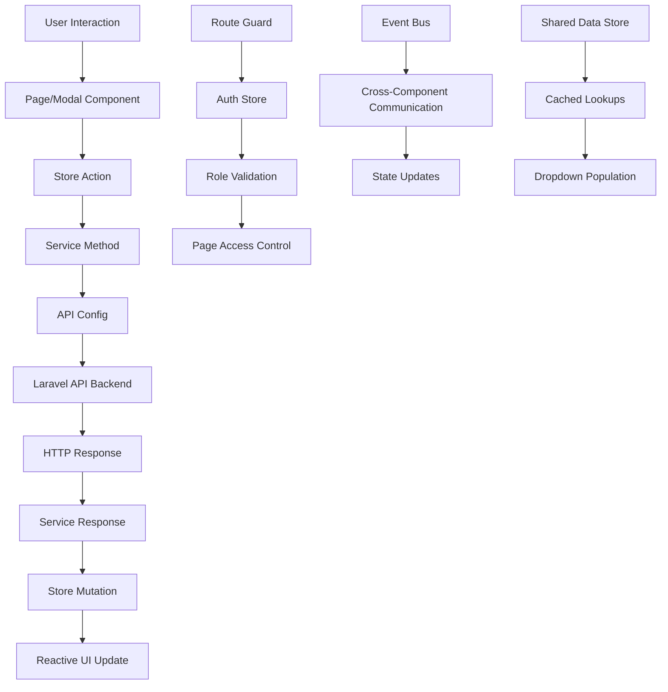

# HRMS Frontend Architecture Documentation

## 🏗️ Overview

This document provides a comprehensive overview of the HRMS (Human Resource Management System) frontend architecture built with Vue.js 3, showing the complete data flow from API endpoints to user interfaces.

## 📋 Table of Contents

1. [Technology Stack](#technology-stack)
2. [Project Structure](#project-structure)
3. [Architecture Layers](#architecture-layers)
4. [Data Flow Diagram](#data-flow-diagram)
5. [Detailed Component Architecture](#detailed-component-architecture)
6. [API Integration Flow](#api-integration-flow)
7. [State Management](#state-management)
8. [Routing & Navigation](#routing--navigation)
9. [Performance Optimizations](#performance-optimizations)
10. [Security & Authentication](#security--authentication)

---

## 🛠️ Technology Stack

### Core Framework
- **Vue.js 3.5.12** - Progressive JavaScript framework
- **Vue Router 4.4.5** - Official router for Vue.js
- **Pinia 3.0.1** - State management library

### UI & Styling
- **Ant Design Vue 4.2.6** - Enterprise-class UI components
- **Bootstrap 5.3.3** - CSS framework
- **Bootstrap Vue 3** - Bootstrap components for Vue.js
- **SCSS/Sass** - CSS preprocessor

### Utilities & Plugins
- **Axios** (via apiService) - HTTP client
- **SweetAlert2** - Beautiful modals/alerts
- **Vue3 ApexCharts** - Modern charting library
- **VeeValidate** - Form validation
- **Vue3 DatePicker** - Date selection components

---

## 📁 Project Structure

```
src/
├── 📁 config/              # Configuration files
│   ├── api.config.js       # API endpoints & base configuration
│   └── role-menu.config.js # Role-based menu configuration
├── 📁 services/            # API service layer (47 services)
│   ├── base.service.js     # Base service with error handling
│   ├── api.service.js      # Core HTTP client wrapper
│   ├── auth.service.js     # Authentication services
│   ├── employee.service.js # Employee-related API calls
│   └── ...                 # Other domain-specific services
├── 📁 stores/              # Pinia state management (16 stores)
│   ├── authStore.js        # Authentication state
│   ├── employeeStore.js    # Employee data management
│   ├── sharedDataStore.js  # Shared dropdown/lookup data
│   └── ...                 # Other domain stores
├── 📁 router/              # Vue Router configuration
│   ├── index.js            # Main router setup
│   └── guards.js           # Route guards (auth, roles)
├── 📁 views/               # Page components (512 files)
│   ├── pages/              # Main application pages
│   │   ├── dashboard/      # Role-based dashboards
│   │   ├── hrm/           # HR management pages
│   │   ├── administration/ # Admin pages
│   │   ├── finance-accounts/ # Finance & payroll
│   │   └── ...            # Other feature modules
│   └── layouts/           # Layout components
├── 📁 components/          # Reusable components
│   ├── modal/             # Modal components (137 files)
│   ├── reports/           # Report components
│   └── breadcrumb/        # Navigation breadcrumbs
├── 📁 utils/              # Utility functions
│   └── performance.js     # Performance optimization utilities
├── 📁 plugins/            # Vue plugins
│   ├── eventBus.js        # Event communication
│   └── echo.js            # WebSocket/real-time communication
├── 📁 constants/          # Application constants
│   └── storageKeys.js     # Local storage key definitions
└── 📁 assets/             # Static assets (CSS, images, fonts)
```

---

## 🏛️ Architecture Layers

### 1. **Configuration Layer**
```
api.config.js → Defines all API endpoints and base URL
role-menu.config.js → Role-based navigation configuration
```

### 2. **Service Layer** (API Integration)
```
base.service.js → Error handling, validation, utilities
api.service.js → HTTP client (Axios wrapper)
[domain].service.js → Domain-specific API calls (47 services)
```

### 3. **State Management Layer** (Pinia Stores)
```
authStore.js → Authentication state & user data
employeeStore.js → Employee data & operations
sharedDataStore.js → Cached dropdown/lookup data
[domain]Store.js → Domain-specific state (16 stores)
```

### 4. **Routing Layer**
```
router/index.js → Route definitions & lazy loading
router/guards.js → Authentication & authorization guards
```

### 5. **Component Layer**
```
views/pages/ → Main application pages (512 files)
components/modal/ → Reusable modal dialogs (137 files)
components/reports/ → Report generation components
layouts/ → Application layout components
```

### 6. **Utility Layer**
```
utils/performance.js → Performance optimization utilities
plugins/eventBus.js → Component communication
constants/ → Application constants
```

---

## 🔄 Data Flow Diagram



---

## 🧩 Detailed Component Architecture

### **API Integration Flow**

#### 1. **API Configuration** (`src/config/api.config.js`)
```javascript
export const API_CONFIG = {
    BASE_URL: process.env.VUE_APP_API_BASE_URL || 'https://hrms-backend-api-v1.cloud/api/v1'
}

export const API_ENDPOINTS = {
    EMPLOYEE: {
        LIST: '/employees',
        CREATE: '/employees',
        UPDATE: '/employees/:id',
        DELETE: '/employees/:id'
    }
    // ... 400+ endpoints organized by domain
}
```

#### 2. **Service Layer** (`src/services/`)
```javascript
// base.service.js - Common error handling
export class BaseService {
    async handleApiResponse(apiCall, operation) {
        // Standardized error handling for all services
    }
}

// employee.service.js - Domain-specific API calls
class EmployeeService extends BaseService {
    async getEmployees(params = {}) {
        return await apiService.get(API_ENDPOINTS.EMPLOYEE.LIST, { params });
    }
}
```

#### 3. **Store Integration** (`src/stores/`)
```javascript
// employeeStore.js - State management
export const useEmployeeStore = defineStore('employee', {
    state: () => ({
        employees: [],
        loading: false,
        error: null
    }),
    
    actions: {
        async fetchEmployees(params = {}) {
            this.loading = true;
            try {
                const response = await employeeService.getEmployees(params);
                this.employees = response.data;
            } catch (error) {
                this.error = error.message;
            } finally {
                this.loading = false;
            }
        }
    }
});
```

#### 4. **Component Usage** (`src/views/pages/`)
```javascript
// employee-list.vue - Page component
<script setup>
import { useEmployeeStore } from '@/stores/employeeStore';

const employeeStore = useEmployeeStore();

onMounted(() => {
    employeeStore.fetchEmployees();
});
</script>

<template>
    <div>
        <loading-spinner v-if="employeeStore.loading" />
        <employee-table :employees="employeeStore.employees" />
        <employee-modal @save="employeeStore.createEmployee" />
    </div>
</template>
```

### **Modal System Architecture**

The application uses a comprehensive modal system with 137+ modals:

```
Modal Categories:
├── 📋 Data Entry Modals (employee-modal.vue, grant-modal.vue)
├── 📊 Report Modals (payroll-report-modal.vue)
├── 🔧 Settings Modals (tax-settings-modal.vue)
├── 👥 User Management (user-list-modal.vue)
└── 📈 Dashboard Modals (admin-dashboard-modal.vue)
```

**Modal Communication Pattern:**
```javascript
// Parent Component
<employee-modal 
    :visible="showModal" 
    :employee="selectedEmployee"
    @save="handleSave"
    @cancel="showModal = false" 
/>

// Modal Component
emit('save', formData);
emit('cancel');
```

---

## 🔄 API Integration Flow

### **Complete Request Flow**

```
1. User Action (Button Click, Form Submit)
   ↓
2. Component Method Call
   ↓
3. Store Action Dispatch
   ↓
4. Service Method Execution
   ↓
5. API Config Endpoint Resolution
   ↓
6. HTTP Request to Laravel Backend
   ↓
7. Response Processing (Success/Error)
   ↓
8. Store State Update
   ↓
9. Reactive UI Update
   ↓
10. User Feedback (Success/Error Messages)
```

### **Error Handling Strategy**

```javascript
// Centralized error handling in BaseService
async handleApiResponse(apiCall, operation) {
    try {
        const response = await apiCall();
        return response;
    } catch (error) {
        switch (error.response?.status) {
            case 404: return { status: 404, message: 'Resource not found' };
            case 422: return { status: 422, errors: error.response.data.errors };
            case 500: return { status: 500, message: 'Server error' };
            default: throw error;
        }
    }
}
```

---

## 📊 State Management

### **Pinia Store Organization** (16 Stores)

```
Authentication & Users:
├── authStore.js          # User authentication, permissions, roles
├── userStore.js          # User management operations

Core Business Logic:
├── employeeStore.js      # Employee data & operations
├── employmentStore.js    # Employment records
├── grantStore.js         # Grant management
├── payrollStore.js       # Payroll calculations

Shared Data:
├── sharedDataStore.js    # Cached dropdowns, lookups
├── lookupStore.js        # System lookup values
├── notificationStore.js  # System notifications

Feature-Specific:
├── interviewStore.js     # Recruitment interviews
├── jobOfferStore.js      # Job offer management
├── trainingStore.js      # Training programs
├── referenceStore.js     # Employee references

UI & Forms:
├── formDraftStore.js     # Form auto-save
├── formPersistenceStore.js # Form state persistence

Administration:
└── adminStore.js         # Admin panel operations
```

### **State Management Patterns**

#### **Shared Data Store Pattern**
```javascript
// Optimized caching for dropdown data
export const useSharedDataStore = defineStore('sharedData', {
    state: () => ({
        departments: [],
        positions: [],
        workLocations: [],
        cacheTimestamps: {},
        loading: false
    }),
    
    getters: {
        isDepartmentsExpired: (state) => {
            const expiry = 24 * 60 * 60 * 1000; // 24 hours
            return Date.now() - state.cacheTimestamps.departments > expiry;
        }
    },
    
    actions: {
        async loadDepartments() {
            if (this.departments.length && !this.isDepartmentsExpired) {
                return this.departments; // Return cached data
            }
            
            const response = await departmentService.getDepartments();
            this.departments = response.data;
            this.cacheTimestamps.departments = Date.now();
        }
    }
});
```

---

## 🛣️ Routing & Navigation

### **Route Organization**
```javascript
// Role-based route protection
{
    path: '/dashboard/admin-dashboard',
    name: 'admin-dashboard',
    component: () => import('@/views/pages/dashboard/admin-dashboard'),
    beforeEnter: roleGuard(['admin']),
    meta: { title: 'Admin Dashboard', requiresAuth: true }
}
```

### **Navigation Security**
```javascript
// Route guards implementation
export const authGuard = (to, from, next) => {
    const authStore = useAuthStore();
    
    if (authStore.isAuthenticated) {
        next();
    } else {
        next('/login');
    }
};

export const roleGuard = (allowedRoles) => (to, from, next) => {
    const authStore = useAuthStore();
    
    if (allowedRoles.includes(authStore.userRole)) {
        next();
    } else {
        next('/unauthorized');
    }
};
```

### **Dynamic Menu Generation**
```javascript
// Role-based menu configuration
export const roleMenuConfig = {
    admin: [
        { name: 'Dashboard', path: '/dashboard/admin-dashboard' },
        { name: 'Employee Management', path: '/hrm/employees' }
    ],
    'hr-manager': [
        { name: 'HR Dashboard', path: '/dashboard/hr-manager-dashboard' }
    ]
    // ... other roles
};
```

---

## ⚡ Performance Optimizations

### **Built-in Performance Features**

#### **1. Lazy Loading**
```javascript
// Route-level code splitting
const routes = [
    {
        path: '/employees',
        component: () => import('@/views/pages/hrm/employees/employee-list.vue')
    }
];
```

#### **2. Performance Utilities** (`src/utils/performance.js`)
```javascript
// Debouncing for search inputs
export function debounce(func, wait, immediate = false) {
    // Implementation for reducing API calls
}

// Virtual scrolling for large datasets
export function createVirtualScrollData(items, itemHeight, containerHeight, scrollTop) {
    // Implementation for rendering only visible items
}

// Memoization for expensive computations
export function memoize(fn, maxSize = 100) {
    // LRU cache implementation
}
```

#### **3. Optimized Data Loading**
```javascript
// SharedDataStore caching strategy
async loadWorkLocations() {
    if (this.isWorkLocationsLoaded) {
        return this.workLocations; // Return cached data
    }
    // Load from API only if not cached or expired
}
```

### **Component Optimization Patterns**

```javascript
// Modal lazy loading
const EmployeeModal = defineAsyncComponent(() => 
    import('@/components/modal/employee-modal.vue')
);

// Event bus for cross-component communication
import eventBus from '@/plugins/eventBus';
eventBus.emit('employee-updated', employeeData);
```

---

## 🔐 Security & Authentication

### **Authentication Flow**

```javascript
// AuthStore - Complete authentication management
export const useAuthStore = defineStore('auth', {
    state: () => ({
        token: localStorage.getItem('authToken'),
        user: null,
        userRole: null,
        permissions: []
    }),
    
    actions: {
        async login(credentials) {
            const response = await authService.login(credentials);
            this.setAuthData(response);
            return this.getRedirectPath();
        },
        
        getRedirectPath() {
            switch (this.userRole) {
                case 'admin': return '/dashboard/admin-dashboard';
                case 'hr-manager': return '/dashboard/hr-manager-dashboard';
                case 'hr-assistant-senior': return '/dashboard/hr-assistant-senior-dashboard';
                case 'hr-assistant-junior': return '/dashboard/hr-assistant-junior-dashboard';
                case 'site-admin': return '/dashboard/site-admin-dashboard';
                default: return '/dashboard';
            }
        }
    }
});
```

### **Role-Based Access Control**

```javascript
// Component-level permission checking
<template>
    <div v-if="canViewEmployees">
        <employee-list />
    </div>
    <div v-if="canEditEmployees">
        <employee-form />
    </div>
</template>

<script setup>
const authStore = useAuthStore();
const canViewEmployees = computed(() => 
    authStore.permissions.includes('view-employees')
);
</script>
```

---

## 🚀 Key Features & Capabilities

### **Multi-Role Support**
- **Admin Dashboard** - Full system access
- **HR Manager Dashboard** - HR operations management
- **HR Assistant (Senior/Junior)** - Role-based HR tasks
- **Site Admin Dashboard** - Site-specific administration

### **Core Modules**
1. **Employee Management** - Complete employee lifecycle
2. **Employment Records** - Employment history and status
3. **Grant Management** - Funding and budget allocation
4. **Payroll System** - Salary calculations and tax management
5. **Reports System** - Comprehensive reporting (14+ report types)
6. **Training Management** - Employee training and development
7. **Leave Management** - Leave requests and approvals
8. **Recruitment** - Job postings, interviews, offers

### **Advanced Features**
- **Real-time Notifications** (WebSocket integration)
- **File Upload System** (Employee photos, documents)
- **Export Capabilities** (PDF, Excel, CSV)
- **Audit Trail** (Recycle bin, change tracking)
- **Multi-language Support** (Internationalization ready)
- **Responsive Design** (Mobile-friendly interface)

---

## 📝 Development Guidelines

### **Adding New Features**

1. **Create API Endpoint** in `api.config.js`
2. **Build Service** extending `BaseService`
3. **Setup Store** with Pinia
4. **Create Page Component** in appropriate module
5. **Add Modal** if needed for data entry
6. **Configure Routes** with proper guards
7. **Test Integration** end-to-end

### **Code Organization Principles**

- **Separation of Concerns** - Clear layer boundaries
- **Reusability** - Shared components and utilities
- **Performance** - Lazy loading and caching
- **Security** - Role-based access control
- **Maintainability** - Consistent patterns and structure

---

## 🔍 Example: Complete Feature Flow

### **Employee Management Feature**

```
1. User navigates to /hrm/employees
   ├── Route guard checks authentication
   ├── Role guard verifies permissions
   └── Component loads (lazy-loaded)

2. Employee List Page (employee-list.vue)
   ├── Calls employeeStore.fetchEmployees()
   ├── Store dispatches to employeeService.getEmployees()
   ├── Service uses API_ENDPOINTS.EMPLOYEE.LIST
   └── Data flows back through the chain

3. User clicks "Add Employee"
   ├── Opens employee-modal.vue
   ├── Modal form uses sharedDataStore for dropdowns
   ├── Form submission calls employeeStore.createEmployee()
   └── Success triggers list refresh

4. Real-time Updates
   ├── WebSocket notification via echo.js
   ├── Event bus broadcasts changes
   └── Other components react to updates
```

---

## 🎯 Summary

This HRMS frontend architecture provides:

- **Scalable Structure** - Modular design supporting 512+ components
- **Robust API Integration** - 47 service classes with centralized error handling
- **Efficient State Management** - 16 Pinia stores with smart caching
- **Role-Based Security** - Comprehensive authentication and authorization
- **Performance Optimized** - Lazy loading, caching, and virtual scrolling
- **Developer Friendly** - Clear patterns and comprehensive tooling

The architecture ensures maintainability, performance, and security while providing a rich user experience across all HR management functions.
