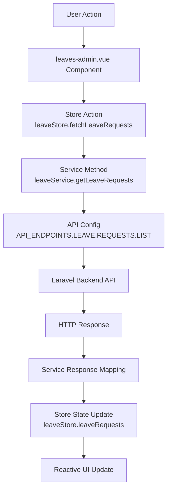
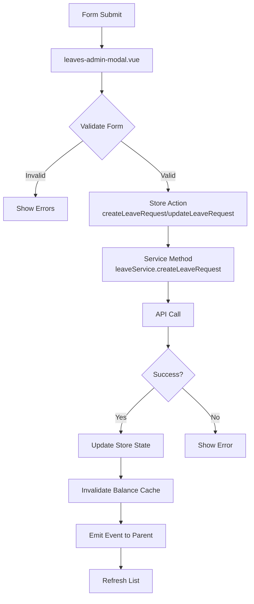

# Leave Management Refactoring Documentation

## 📋 Overview

This document describes the refactoring of the Leave Management system to follow the HRMS Frontend Architecture pattern, removing composables in favor of a direct store-service approach.

## 🎯 Objectives

1. **Simplify Architecture**: Remove composables and use Pinia store directly
2. **Follow HRMS Patterns**: Align with the established architecture (api.config.js → service → store → component)
3. **Improve Validation**: Ensure proper form validation and error handling
4. **Store Updates**: Automatically update store after CRUD operations
5. **Better State Management**: Centralized state management through Pinia store

## 🏗️ Architecture Changes

### Before (Composable-based)
```
Component → Composable → Service → API
                ↓
              Store (optional)
```

### After (Store-based)
```
Component → Store → Service → API Config → Backend
              ↓
         State Updates
```

## 📁 Files Modified

### 1. `src/views/pages/hrm/attendance/leaves/leaves-admin.vue`

#### Key Changes:

**Removed:**
- `useLeaveRequests` composable
- `useLeaveTypes` composable
- Direct composable method calls

**Added:**
- Direct `useLeaveStore()` usage
- Computed properties from store state
- Store action calls for all operations

**Implementation Pattern:**
```javascript
// Old (Composable)
const { leaveRequests, fetchLeaveRequests } = useLeaveRequests();

// New (Store)
const leaveStore = useLeaveStore();
const leaveRequests = computed(() => leaveStore.leaveRequests);
await leaveStore.fetchLeaveRequests();
```

#### Updated Methods:

1. **Pagination**:
   - `goToPage()` - Now calls `leaveStore.setPage()` and `fetchLeaveRequests()`
   - `nextPage()` - Uses `leaveStore.nextPage()`
   - `previousPage()` - Uses `leaveStore.previousPage()`
   - `changePerPage()` - Uses `leaveStore.setPageSize()`

2. **Filtering**:
   - `setLeaveTypeFilter()` - Updates `leaveStore.filteredInfo`
   - `setStatusFilter()` - Updates `leaveStore.filteredInfo`
   - `setSortFilter()` - Updates `leaveStore.sortedInfo`
   - `debouncedSearch()` - Uses `leaveStore.setSearch()`

3. **CRUD Operations**:
   - `editLeaveRequest()` - Uses `leaveStore.setCurrentLeaveRequest()`
   - `handleDeleteLeaveRequest()` - Uses `leaveStore.deleteLeaveRequest()` with automatic refresh
   - `handleLeaveRequestCreated()` - Uses `leaveStore.fetchLeaveRequests()` to refresh

### 2. `src/components/modal/leaves-admin-modal.vue`

#### Key Changes:

**Removed:**
- `useLeaveRequests` composable for balance caching
- Direct service calls for CRUD operations

**Added:**
- Direct `useLeaveStore()` usage
- Store methods for balance management
- Store actions for create/update operations

**Implementation Pattern:**
```javascript
// Old (Composable)
const { getCachedLeaveBalance } = useLeaveRequests();
const result = await getCachedLeaveBalance(employeeId, leaveTypeId, year);

// New (Store)
const leaveStore = useLeaveStore();
const result = await leaveStore.getOrFetchLeaveBalance(employeeId, leaveTypeId, year);
```

#### Updated Methods:

1. **Balance Loading**:
   - `loadLeaveBalance()` - Uses `leaveStore.getOrFetchLeaveBalance()`
   - `loadEditLeaveBalance()` - Uses `leaveStore.getOrFetchLeaveBalance()`
   - `forceRefreshBalance()` - Uses `leaveStore.refreshLeaveBalance()`

2. **Form Submission**:
   - `submitForm()` - Uses `leaveStore.createLeaveRequest()` or `leaveStore.updateLeaveRequest()`
   - Automatic store update after successful operation
   - Proper validation before submission
   - Comprehensive error handling

## 🔄 Data Flow

### Complete Request Flow (Following HRMS Architecture)



### Create/Update Flow



## ✅ Validation & Error Handling

### Form Validation
```javascript
validateForm(formData) {
    this.errors = {};
    
    // Required fields
    if (!formData.employee_id) {
        this.errors.employee_id = 'Employee is required';
    }
    
    if (!formData.leave_type_id) {
        this.errors.leave_type_id = 'Leave type is required';
    }
    
    // Date validation
    if (!formData.start_date) {
        this.errors.start_date = 'Start date is required';
    }
    
    // Balance validation
    if (this.availableBalance > 0 && formData.total_days > this.availableBalance) {
        this.errors.total_days = `Insufficient leave balance. Available: ${this.availableBalance} days`;
    }
    
    return Object.keys(this.errors).length === 0;
}
```

### Store Update After Operations

**Create Operation:**
```javascript
async createLeaveRequest(leaveRequestData) {
    this.submitting = true;
    try {
        const response = await leaveService.createLeaveRequest(leaveRequestData);
        
        if (response.success) {
            // Add to local state
            this.leaveRequests.unshift(response.data);
            this.total += 1;
            
            // Invalidate cache
            this.invalidateEmployeeLeaveCache(
                response.data.employee_id, 
                response.data.leave_type_id
            );
            
            return { success: true, data: response.data };
        }
    } finally {
        this.submitting = false;
    }
}
```

**Update Operation:**
```javascript
async updateLeaveRequest(id, leaveRequestData) {
    this.submitting = true;
    try {
        const response = await leaveService.updateLeaveRequest(id, leaveRequestData);
        
        if (response.success) {
            // Update in local state
            const index = this.leaveRequests.findIndex(req => req.id === parseInt(id));
            if (index !== -1) {
                this.leaveRequests[index] = response.data;
            }
            
            // Invalidate cache if status changed
            if (shouldInvalidateCache) {
                this.invalidateEmployeeLeaveCache(
                    response.data.employee_id, 
                    response.data.leave_type_id
                );
            }
            
            return { success: true, data: response.data };
        }
    } finally {
        this.submitting = false;
    }
}
```

**Delete Operation:**
```javascript
async deleteLeaveRequest(id) {
    try {
        const deletedRequest = this.leaveRequests.find(req => req.id === parseInt(id));
        const response = await leaveService.deleteLeaveRequest(id);
        
        if (response.success) {
            // Remove from local state
            this.leaveRequests = this.leaveRequests.filter(req => req.id !== parseInt(id));
            this.total -= 1;
            
            // Invalidate cache
            if (deletedRequest) {
                this.invalidateEmployeeLeaveCache(
                    deletedRequest.employee_id, 
                    deletedRequest.leave_type_id
                );
            }
            
            return { success: true };
        }
    }
}
```

## 📊 State Management

### Store State Structure
```javascript
state: () => ({
    // Data
    leaveRequests: [],
    currentLeaveRequest: null,
    statistics: {
        totalRequests: 0,
        pendingRequests: 0,
        approvedRequests: 0,
        declinedRequests: 0
    },
    leaveTypes: [],
    
    // Cache
    leaveBalanceCache: new Map(), // "employeeId-leaveTypeId-year" -> balance
    
    // UI State
    loading: false,
    submitting: false,
    error: null,
    
    // Pagination
    currentPage: 1,
    pageSize: 10,
    total: 0,
    
    // Filters
    filteredInfo: {},
    sortedInfo: {},
    searchStaffId: '',
    dateRange: null
})
```

### Cache Management

**Cache Key Format:**
```javascript
const cacheKey = `${employeeId}-${leaveTypeId}-${year}`;
```

**Cache Invalidation:**
- After creating a leave request
- After updating a leave request (if status changes to/from approved)
- After deleting a leave request
- Manual refresh via `refreshLeaveBalance()`

**Cache Duration:**
- Leave balances: 5 minutes (300,000 ms)
- Leave types: 24 hours

## 🚀 Benefits

1. **Simplified Architecture**
   - Single source of truth (Pinia store)
   - Clearer data flow
   - Easier to debug and maintain

2. **Better Performance**
   - Cached leave balances (5 min)
   - Cached leave types (24 hours)
   - Automatic cache invalidation
   - Optimistic UI updates

3. **Improved Validation**
   - Comprehensive form validation
   - Balance checking
   - Error handling at multiple levels
   - User-friendly error messages

4. **Automatic Store Updates**
   - State automatically updated after CRUD
   - Cache invalidation when needed
   - Consistent data across components

5. **Consistent Patterns**
   - Follows HRMS Frontend Architecture
   - Matches employee management patterns
   - Reusable across the application

## 📝 Usage Examples

### Fetching Leave Requests
```javascript
// In component
const leaveStore = useLeaveStore();

// Fetch with filters
await leaveStore.fetchLeaveRequests({
    status: 'approved',
    leave_types: '1,2,3'
});

// Access data
const leaveRequests = computed(() => leaveStore.leaveRequests);
const stats = computed(() => leaveStore.statistics);
```

### Creating a Leave Request
```javascript
// In modal component
const leaveStore = useLeaveStore();

const result = await leaveStore.createLeaveRequest({
    employeeId: 123,
    leaveTypeId: 1,
    startDate: '2024-01-15',
    endDate: '2024-01-17',
    totalDays: 3,
    reason: 'Family vacation'
});

if (result.success) {
    // Store automatically updated
    // Cache automatically invalidated
    // Emit event to parent for UI refresh
}
```

### Updating a Leave Request
```javascript
const leaveStore = useLeaveStore();

const result = await leaveStore.updateLeaveRequest(requestId, {
    status: 'approved',
    supervisorName: 'John Doe',
    supervisorApprovalDate: '2024-01-10'
});

if (result.success) {
    // Store state updated
    // Cache invalidated if needed
}
```

### Getting Leave Balance
```javascript
// Get cached or fetch
const result = await leaveStore.getOrFetchLeaveBalance(
    employeeId, 
    leaveTypeId, 
    year
);

if (result.success) {
    const balance = result.data.remainingDays;
    console.log(`From cache: ${result.fromCache}`);
}

// Force refresh
const freshResult = await leaveStore.refreshLeaveBalance(
    employeeId, 
    leaveTypeId, 
    year
);
```

## 🔍 Testing Checklist

- [ ] Create leave request updates store
- [ ] Update leave request updates store  
- [ ] Delete leave request updates store
- [ ] Balance cache invalidation works
- [ ] Pagination works correctly
- [ ] Filters update store and refresh data
- [ ] Search debouncing works
- [ ] Form validation prevents invalid submissions
- [ ] Error messages display correctly
- [ ] Success messages display correctly
- [ ] Modal opens/closes properly
- [ ] Data persists across page changes

## 📚 Related Documentation

- [HRMS Frontend Architecture](./HRMS_FRONTEND_ARCHITECTURE.md)
- [Adding New Feature Guide](./ADDING_NEW_FEATURE_GUIDE.md)
- [Leave Report Documentation](./LEAVE_REPORT_API_UPDATE_DOCUMENTATION.md)

## 🔄 Migration from Composables to Store

If you have other features using composables, follow this migration pattern:

### Step 1: Update Component
```javascript
// Old
import { useLeaveRequests } from '@/composables/useLeaveRequests';
const { leaveRequests, fetchLeaveRequests } = useLeaveRequests();

// New
import { useLeaveStore } from '@/stores/leaveStore';
const leaveStore = useLeaveStore();
const leaveRequests = computed(() => leaveStore.leaveRequests);
await leaveStore.fetchLeaveRequests();
```

### Step 2: Update Store Actions
```javascript
// Ensure store has actions for all operations
actions: {
    async fetchLeaveRequests(params = {}) {
        this.loading = true;
        try {
            const response = await leaveService.getLeaveRequests(params);
            if (response.success) {
                this.leaveRequests = response.data;
                // Update pagination, stats, etc.
            }
        } finally {
            this.loading = false;
        }
    }
}
```

### Step 3: Remove Composable
- Once all components migrated, remove the composable file
- Update imports across the application
- Test thoroughly

## ✅ Summary

The Leave Management system has been successfully refactored to:
- ✅ Follow HRMS Frontend Architecture pattern
- ✅ Use Pinia store for all state management
- ✅ Remove composable dependencies for simpler code
- ✅ Implement comprehensive validation
- ✅ Automatic store updates after CRUD operations
- ✅ Intelligent cache management
- ✅ Better error handling
- ✅ Consistent with employee management patterns

This refactoring makes the codebase more maintainable, performant, and easier to understand for new developers.
